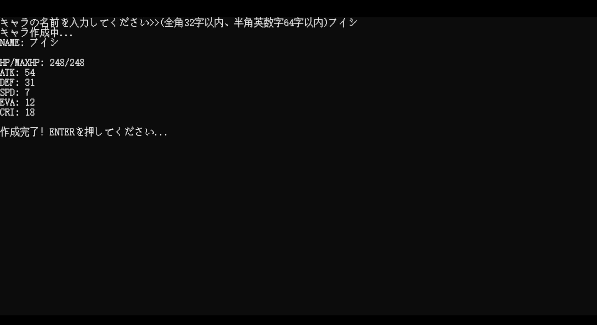
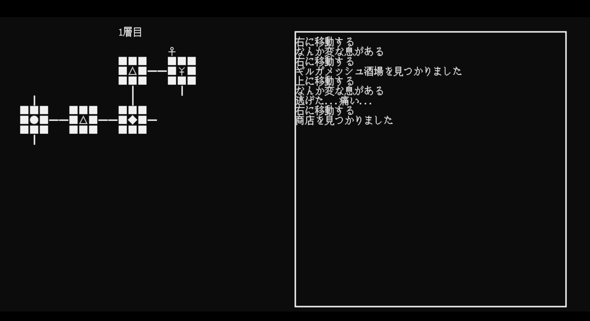
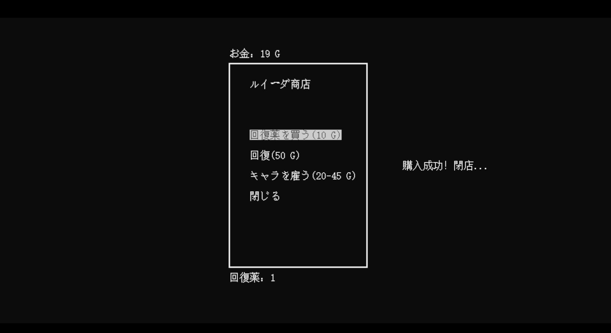

# Dungeon

***

### 制作时间

- 2020年12月

### 制作工具

- C语言

### 游戏标签

- 冒险/探索

### 游戏简介

- 《Dungeon》是一款地牢探险类的C语言控制台游戏。你需要在地牢中招募角色，探索随机生成的房间，合理安排策略，谨慎做出选择，才有机会直面地牢的守护者ギルガメッシュ・ルイーダ。

### 实机截图

### [演示视频&游戏本体（Dropbox）](https://www.dropbox.com/sh/vpxjtqu52utl6bf/AABwisRezA_m_1ZM9CoxFkica?dl=0)

### [演示视频&游戏本体（腾讯微云）](https://share.weiyun.com/SBj5JgPj)

### [源码](https://github.com/Vera-Fu/Dungeon-.git)

***

### 游戏制作详情

- 本游戏为我在学校第一学期的期中作业。游戏的主题为“姓名battle”，核心要求是玩家输入名称后随机生成角色属性，并且可以进行简单的战斗。
  
- 在此要求上，我为游戏加入了地牢探索的玩法。为游戏增加了大量的不确定性和随机性。玩家在游戏中扮演一个地牢探险者小队的队长，在地牢的酒馆中输入名字招募角色，强化自己的小队，合理的使用地牢中的房间，最终挑战地牢的守护者。

- 游戏中也有一些可以帮助玩家更加轻易通关的策略。比如，游戏中贯彻了“姓名battle”的设定，即角色的属性只与姓名有关。也就是说，当玩家遇到无法战胜的强力敌人时，可以将敌人的名字先记下，先行逃跑，随后到酒馆中去招募拥有该名字的角色进入队伍。为了让玩家注意到这点，我做出了如下设计：
    1. 玩家无法招募相同姓名的角色
    2. 玩家在输入名称后到生成数据时需要加载
    3. 敌人的姓名用特别的颜色进行了标注

- 游戏中还隐藏了一些彩蛋等待玩家发掘，并且拥有多周目游玩的设计。

### 碎碎念

- 这个游戏算是我来到日本留学以后做的第一款游戏，虽然还有很多不成熟的地方，但是游戏的完成度已经很让我满意了。甚至可以说，这是我到目前为止所做的游戏中完成度最高的一款。从0到1的完整游戏流程，保存游戏，隐藏在游戏中的设计等等。

- 我后续开发的游戏都是偏向以“学习”的目的为主，所以在很多地方反而并没有这一款游戏考虑得这么周全与详尽……

- 根据大伙们的反馈，游戏中的随机性有时会让人心态小崩，这点我后续也注意到了，但是并没有重新进行修改（虽然脑子里有修改方案了，但还是保持着这个游戏最初的模样吧哈哈，后面的游戏中会注意这些点的）。

- 希望你能玩得开心，谢谢你玩我的游戏。