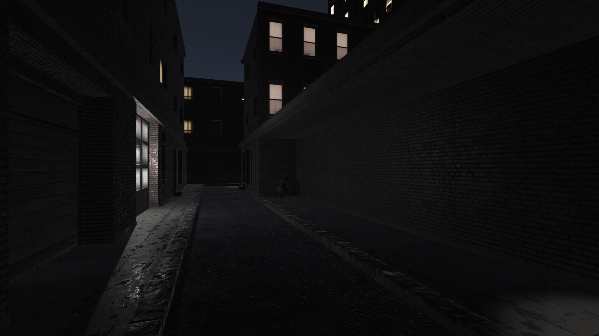
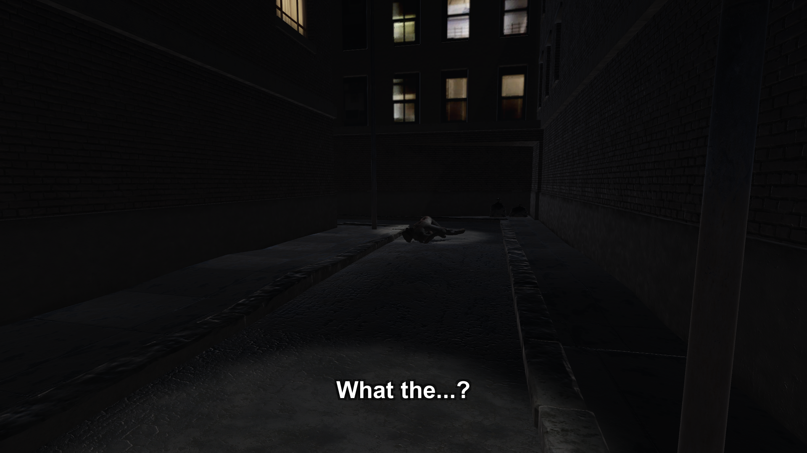

# Zombie

***

### 制作时间

- 2022年2月

### 制作工具

- Unity

### 游戏标签

- 恐怖/丧尸/过场动画

### 游戏简介

- 深夜，下班回家途中，男人的惨叫，玻璃破碎的声音，奇怪的女人。越过转角，有什么东西似乎在趴在地上吃着什么东西。噢，是人在吃人。

### 实机截图

### [演示视频&游戏本体（Dropbox）](https://www.dropbox.com/sh/0px52h99w599vyu/AADk_cjZIHoLJtU-JT-A0Nyba?dl=0)

### [演示视频&游戏本体（腾讯微云）](https://share.weiyun.com/uMIL5QzS)

（注: 由于演示动画即为游戏的全部内容，故不在此上传本体）

***

### 游戏制作详情

- 本游戏是以学习Unity3D相关知识（主要是Timeline相关内容）为目的进行创作的。算是一个简单的demo。
  
- 虽说是游戏，但其实整个游戏就是简单的步行模拟+过场动画，演示视频中的40秒即是游戏中的全部内容。

- 除了Unity3D相关知识的学习外，本游戏中我还尝试了一下“场景叙事”。先简单讲述一下玩家在场景中会碰到的内容：最开始，向前行走，会听到一个男人和一只猫的惨叫。随后继续往前，会听到玻璃破碎的声音，这时会听到右边有个奇怪的声音，并且会看到一个奇怪的女人蹲在地上。继续往前，走到路灯下，路灯开始闪烁，随后熄灭，玩家的视线会被引导至远处的路灯处，既可以看到丧尸和丧尸正在啃食着的人。虽然有点难看清，但是被啃食的人身上穿着警察的衣服。玩家可操作的部分到此为止，随后便是用Timeline做的过场动画，主人公想逃离的时候，却被在后方的女性丧尸扑倒袭击了。游戏结束。

- 在这些内容下隐藏的故事是，丧尸病毒刚刚开始爆发，有个男人被丧尸化的女人袭击了。被袭击后呼叫了警察，但是警察到来的时候男人亦变成了丧尸，攻击了警察。大概就是这么一个背景。

- 虽说游戏很短，但是作为一个步行模拟器所需要的内容其实已经基本实现了。后续想继续开发的话只需继续绑定事件、搭建场景和设置Timeline即可。

### 碎碎念

- 做这个游戏的时候其实被一个很奇怪的灯光bug困扰了一段时间，就是当烘焙灯光的时候有部分灯光会直接失去效果导致场景变暗。因此视频里的灯光效果其实是没有烘焙过的，稍微设置调整了一下就进行打包了……虽然最终呈现出来的效果还可以……

- 后续翻资料翻半天也是顺利找出问题所在了，排除了资料中所有的可能性然后才发现原来只不过是灯光在烘焙的时候被模型给挡住了……

- 说实话当时为了解决那个bug甚至打算开始去学图形学和渲染相关的内容了，又是一个深坑啊。好在顺利解决了，不过也借此确实感觉还是多拓展点知识面会好一点。

- 希望你没被吓到，谢谢你看我的游戏。